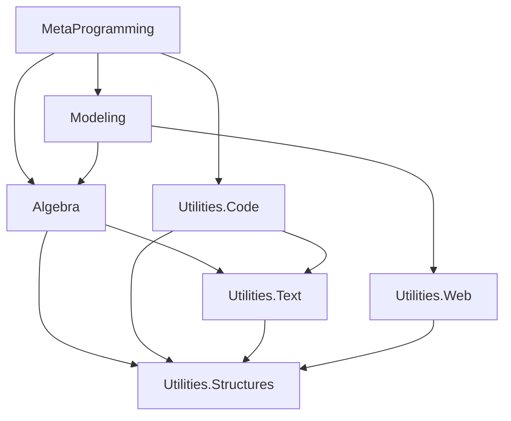

# Geometric Algebra Fulcrum Library (GA-FuL) - Comprehensive Analysis

## Executive Summary

The Geometric Algebra Fulcrum Library (GA-FuL) is an advanced C# mathematical computing library designed for Geometric Algebra computations across multiple scalar types (floating point, rational, symbolic). The library implements a sophisticated layered architecture based on Data-Oriented Programming (DOP) principles to provide unified, generic, and extensible APIs for numerical computing, symbolic manipulation, and optimized code generation.

## Architecture Overview

<details>
<summary><strong>Four-Layer Architecture Design</strong></summary>

GA-FuL follows a sophisticated four-layer architecture design:

1. **System Utilities Layer** (Foundation)
2. **Algebra Layer** (Core Mathematics)
3. **Modeling Layer** (High-level Abstractions)
4. **Metaprogramming Layer** (Code Generation)

### Data Flow Between Layers
```
Layer 4: MetaProgramming (Code Generation)
    ↓ depends on
Layer 3: Modeling (High-level Abstractions) 
    ↓ depends on      
Layer 2: Algebra (Core Mathematics)
    ↓ depends on      
Layer 1: System Utilities (Foundation)
```

</details>

<details>
<summary><strong>Design Principles (Data-Oriented Programming)</strong></summary>

The library is built on Data-Oriented Programming (DOP) principles:

- **DOP-1**: Separation of behavior code from data
- **DOP-2**: Generic data structures (dictionaries, arrays)
- **DOP-3**: Immutable data with composer pattern
- **DOP-4**: Separation of data representation from schema

### Why DOP?
DOP provides several advantages over traditional OOP for GA-FuL:
- **Reduced Complexity**: Avoids deep coupling between data and behavior
- **Better Performance**: More efficient memory usage and operations
- **Enhanced Maintainability**: Easier to understand and extend
- **Type Safety**: Generic design with compile-time type checking

</details>

## Project Structure Analysis

<details>
<summary><strong>Solution Organization</strong></summary>

The repository contains two main solutions:

- **Main Solution**: `GeometricAlgebraFulcrumLib.sln` (15 projects)
- **Auxiliary Solution**: `GAPoTNumLib.sln` (2 projects)

### Repository Structure
```
GeometricAlgebraFulcrumLib/
├── GeometricAlgebraFulcrumLib/           # Main solution directory
│   ├── GeometricAlgebraFulcrumLib.Utilities.Structures/
│   ├── GeometricAlgebraFulcrumLib.Utilities.Text/
│   ├── GeometricAlgebraFulcrumLib.Utilities.Code/
│   ├── GeometricAlgebraFulcrumLib.Algebra/
│   ├── GeometricAlgebraFulcrumLib.Modeling/
│   ├── GeometricAlgebraFulcrumLib.MetaProgramming/
│   └── ... (other projects)
├── GAPoTNumLib/                          # Auxiliary solution
└── README.adoc                           # Main documentation
```

</details>

<details>
<summary><strong>Project Dependencies and Layers</strong></summary>

### Dependency Graph


</details>

### Layer 1: System Utilities (Foundation)

<details>
<summary><strong>GeometricAlgebraFulcrumLib.Utilities.Structures</strong></summary>

**Purpose**: Core data structures and fundamental utilities

**Dependencies**: External NuGet packages only

**Key Components**:
- **IndexSets**: Basis blade index management with optimized implementations
- **Collections**: Sparse and dense data structures for efficient storage
- **Dictionary**: Custom dictionary implementations for multivector storage
- **Dependency**: Dependency graph management for complex relationships
- **BitManipulation**: Low-level bit operations for performance
- **Extensions**: Extension methods for system types

**Example Usage**:
```csharp
using GeometricAlgebraFulcrumLib.Utilities.Structures.IndexSets;

// Create an index set for a basis blade e_{1,2,3}
var indexSet = IndexSetUtils.CreateFromIndices(1, 2, 3);

// Check properties
Console.WriteLine($"Grade: {indexSet.Count}");              // 3
Console.WriteLine($"VSpace Dimensions: {indexSet.VSpaceDimensions}"); // 4
Console.WriteLine($"Is Empty: {indexSet.IsEmpty}");         // False

// Operations
var newSet = indexSet.Add(4);                               // e_{1,2,3,4}
var intersection = indexSet.SymmetricExcept(IndexSetUtils.CreateFromIndices(2, 3, 4)); // e_{1,4}
```

**External Dependencies**:
- MathNet.Numerics (numerical computations)
- PeterO.Numbers (arbitrary precision arithmetic)
- System.Drawing libraries (graphics primitives)

</details>

<details>
<summary><strong>GeometricAlgebraFulcrumLib.Utilities.Text</strong></summary>

**Purpose**: Text generation and formatting utilities

**Dependencies**: Utilities.Structures

**Key Components**:
- **Text Composers**: Hierarchical text building with indentation
- **LaTeX Generation**: Mathematical formula formatting
- **Parametric Templates**: Template-based text generation
- **File Management**: Multi-file text generation utilities

**Example Usage**:
```csharp
using GeometricAlgebraFulcrumLib.Utilities.Text.Text;

// Create a text composer
var composer = new LinearTextComposer();

composer
    .AppendLine("// Generated GA operations")
    .AppendLine("public class Vector3D")
    .AppendLine("{")
    .IncreaseIndentation()
    .AppendLine("public double X { get; set; }")
    .AppendLine("public double Y { get; set; }")
    .AppendLine("public double Z { get; set; }")
    .DecreaseIndentation()
    .AppendLine("}");

string result = composer.ToString();
Console.WriteLine(result);
```

**Dependencies**: Utilities.Structures + External packages
- CsvHelper (CSV processing)
- Humanizer (text humanization)
- Newtonsoft.Json (JSON processing)

</details>

<details>
<summary><strong>GeometricAlgebraFulcrumLib.Utilities.Code</strong></summary>

**Purpose**: Code generation and compilation utilities

**Dependencies**: Utilities.Structures, Utilities.Text

**Key Components**:
- **Abstract Syntax Trees**: Language-agnostic code representation
- **Code Generators**: Multi-language code generation
- **Parser Integration**: Irony parser framework integration
- **Dynamic Compilation**: Runtime code compilation

**Example Usage**:
```csharp
using GeometricAlgebraFulcrumLib.Utilities.Code;

// Create a code composer for C# generation
var codeComposer = new CSharpCodeComposer();

codeComposer
    .AppendLine("using System;")
    .AppendLine()
    .AppendLine("namespace GeneratedCode")
    .AppendLine("{")
    .IncreaseIndentation()
    .AppendLine("public static class MathOperations")
    .AppendLine("{")
    .IncreaseIndentation()
    .AppendLine("public static double DotProduct(double[] a, double[] b)")
    .AppendLine("{")
    .IncreaseIndentation()
    .AppendLine("return a[0] * b[0] + a[1] * b[1] + a[2] * b[2];")
    .DecreaseIndentation()
    .AppendLine("}")
    .DecreaseIndentation()
    .AppendLine("}")
    .DecreaseIndentation()
    .AppendLine("}");

string generatedCode = codeComposer.ToString();
```

**Dependencies**: Utilities.Structures, Utilities.Text + External packages
- CS-Script (dynamic C# compilation)
- Irony parser libraries
- Magick.NET (image processing)

</details>

<details>
<summary><strong>GeometricAlgebraFulcrumLib.Utilities.Web</strong></summary>

**Purpose**: Web-based graphics and visualization utilities

**Key Components**:
- Web graphics generation for browser-based visualization
- HTML/JavaScript output formatting
- Integration support for web rendering backends

</details>

### Layer 2: Algebra (Core Mathematics)

<details>
<summary><strong>GeometricAlgebraFulcrumLib.Algebra - Core Mathematical Engine</strong></summary>

**Purpose**: Core algebraic operations and structures

**Dependencies**: Utilities.Structures, Utilities.Text

**Architecture Overview**:
```
Algebra/
├── Scalars/                 # Scalar processor implementations
│   ├── Generic/             # Generic scalar interfaces
│   ├── Float64/             # Double precision scalars
│   └── Float32/             # Single precision scalars
├── GeometricAlgebra/        # GA core implementation
│   ├── Basis/               # Basis blade operations
│   ├── Generic/             # Generic GA framework
│   │   ├── Processors/      # GA space processors
│   │   ├── Multivectors/    # Multivector implementations
│   │   ├── LinearMaps/      # Linear transformations
│   │   └── Subspaces/       # GA subspace utilities
│   ├── Float64/             # Optimized Float64 GA
│   └── Structures/          # Common GA data structures
├── LinearAlgebra/           # Classical linear algebra
├── ComplexAlgebra/          # Complex number algebra
├── Polynomials/             # Polynomial algebra
└── TensorAlgebra/           # Tensor operations
```

#### Scalar Processing System

**Core Interface**:
```csharp
public interface IScalarProcessor<T>
{
    // Constants
    T ZeroValue { get; }
    T OneValue { get; }
    T MinusOneValue { get; }
    T PiValue { get; }
    
    // Core operations
    T Add(T scalar1, T scalar2);
    T Multiply(T scalar1, T scalar2);
    T Divide(T scalar1, T scalar2);
    T Negative(T scalar);
    
    // Mathematical functions
    T Cos(T scalar);
    T Sin(T scalar);
    T Sqrt(T scalar);
    T Power(T baseScalar, T scalar);
    
    // Utilities
    bool IsZero(T scalar);
    bool IsNearZero(T scalar);
    bool IsValid(T scalar);
}
```

**Hierarchy**:
```csharp
IScalarProcessor<T>
├── INumericScalarProcessor<T>
│   ├── ScalarProcessorOfFloat64        // Double precision
│   ├── ScalarProcessorOfFloat32        // Single precision  
│   ├── ScalarProcessorOfComplex        // Complex numbers
│   └── ScalarProcessorOfERational      // Arbitrary precision rationals
└── ISymbolicScalarProcessor<T>
    └── (Integration with CAS systems)   // Computer Algebra Systems
```

**Example - Basic Scalar Operations**:
```csharp
using GeometricAlgebraFulcrumLib.Algebra.Scalars.Generic;

// Create a Float64 scalar processor
var scalarProcessor = ScalarProcessorOfFloat64.Instance;

// Basic operations
var a = scalarProcessor.ScalarFromNumber(3.0);
var b = scalarProcessor.ScalarFromNumber(4.0);

var sum = a.Add(b);                    // 7.0
var product = a.Multiply(b);           // 12.0
var power = a.Power(2);                // 9.0
var sqrt = scalarProcessor.Sqrt(product); // sqrt(12) ≈ 3.464

Console.WriteLine($"3 + 4 = {sum}");
Console.WriteLine($"3 * 4 = {product}");
Console.WriteLine($"3² = {power}");
Console.WriteLine($"√12 = {sqrt}");
```

#### Geometric Algebra Core

**Multivector Hierarchy**:
```csharp
XGaMultivector<T>
├── XGaScalar<T>                // Grade 0 (scalars)
├── XGaVector<T>                // Grade 1 (vectors)
├── XGaBivector<T>              // Grade 2 (bivectors)
├── XGaHigherKVector<T>         // Grade k > 2
├── XGaGradedMultivector<T>     // Mixed grades
└── XGaUniformMultivector<T>    // Uniform coefficients
```

**GA Processor Hierarchy**:
```csharp
XGaProcessor<T>
├── XGaEuclideanProcessor<T>    // Euclidean spaces (signature +++)
├── XGaProjectiveProcessor<T>   // Projective spaces (signature +++0)
└── XGaConformalProcessor<T>    // Conformal spaces (signature +++-0)
```

**Example - Basic GA Operations**:
```csharp
using GeometricAlgebraFulcrumLib.Algebra.Scalars.Generic;
using GeometricAlgebraFulcrumLib.Algebra.GeometricAlgebra.Generic.Processors;

// 1. Create scalar processor for double precision
var scalarProcessor = ScalarProcessorOfFloat64.Instance;

// 2. Create 3D Euclidean GA processor
var processor = XGaProcessor<double>.CreateEuclidean(scalarProcessor);

// 3. Create vectors
var v1 = processor.CreateVector(1, 2, 3);
var v2 = processor.CreateVector(4, 5, 6);

// 4. Perform GA operations
var outerProduct = v1.Op(v2);        // Outer product → bivector
var geometricProduct = v1.Gp(v2);    // Geometric product → scalar + bivector
var scalarProduct = v1.Sp(v2);       // Scalar product (inner product) → 32.0

Console.WriteLine($"v1 = {v1}");                    // <1, 2, 3>
Console.WriteLine($"v2 = {v2}");                    // <4, 5, 6>  
Console.WriteLine($"v1 ∧ v2 = {outerProduct}");     // Bivector result
Console.WriteLine($"v1 * v2 = {geometricProduct}"); // Full geometric product
Console.WriteLine($"v1 · v2 = {scalarProduct}");    // 32.0
```

**Example - Multivector Composition**:
```csharp
// Create a multivector composer for efficient construction
var composer = processor.CreateComposer();

composer
    .SetTerm(0, 5.0)                    // Scalar part
    .SetVectorTerm(1, 2.0)              // e1 coefficient  
    .SetVectorTerm(2, 3.0)              // e2 coefficient
    .SetBivectorTerm(0, 1, 1.5);        // e12 coefficient

var multivector = composer.GetMultivector();

Console.WriteLine($"Multivector: {multivector}");
Console.WriteLine($"Grade 0 part: {multivector.GetScalarPart()}");
Console.WriteLine($"Grade 1 part: {multivector.GetVectorPart()}");
Console.WriteLine($"Grade 2 part: {multivector.GetBivectorPart()}");
```

**External Dependencies**:
- AngouriMath (symbolic mathematics)
- MathNet.Numerics (numerical computations)
- EPPlus (Excel integration)
- PeterO.Numbers (arbitrary precision)
- SixLabors.ImageSharp (image processing)

</details>

### Layer 3: Modeling (High-Level Abstractions)

<details>
<summary><strong>GeometricAlgebraFulcrumLib.Modeling - Geometric Modeling and Visualization</strong></summary>

**Purpose**: High-level geometric modeling and visualization

**Dependencies**: Algebra, Utilities.Web

**Architecture Overview**:
```
Modeling/
├── Geometry/                # Geometric object representations
│   ├── CGa/                 # Conformal GA geometry
│   ├── PGa/                 # Projective GA geometry  
│   ├── VGa/                 # Vector GA geometry
│   ├── Euclidean/           # Classical Euclidean geometry
│   ├── Parametric/          # Parametric curves/surfaces
│   └── BasicShapes/         # Primitive geometric shapes
├── Graphics/                # Visualization and rendering
│   ├── Rendering/           # Rendering backends
│   │   ├── BabylonJs/       # Babylon.js integration
│   │   ├── WebGL/           # WebGL rendering
│   │   ├── GLTF2/           # glTF 2.0 export
│   │   └── GraphViz/        # GraphViz diagram generation
│   ├── Computers/           # Computational geometry
│   └── GeometricAlgebra/    # GA-specific graphics
└── Samples/                 # Example implementations
```

#### Conformal Geometric Algebra (CGA) Support

**CGA for 3D Geometry**:
```csharp
public class XGaConformalSpace5D<T>
{
    // Encoding geometric objects as CGA multivectors
    public XGaVector<T> EncodeIpnsRound.Point(T x, T y, T z);
    public XGaMultivector<T> EncodeIpnsRound.Sphere(T centerX, T centerY, T centerZ, T radius);
    public XGaMultivector<T> EncodeOpnsFlat.Line(Vector3D<T> point, Vector3D<T> direction);
    public XGaMultivector<T> EncodeOpnsFlat.Plane(Vector3D<T> point, Vector3D<T> normal);
    
    // Decoding CGA multivectors to geometric components
    public CGaFloat64Element<T> Decode.OpnsRound.Element(XGaMultivector<T> cgaMultivector);
    public CGaFloat64Element<T> Decode.OpnsFlat.Element(XGaMultivector<T> cgaMultivector);
    
    // Geometric operations
    public XGaMultivector<T> ReflectOpnsIn(XGaMultivector<T> opnsObject, XGaVector<T> mirror);
    public XGaMultivector<T> ProjectOpnsOn(XGaMultivector<T> opnsObject, XGaMultivector<T> subspace);
}
```

**Example - CGA Geometric Operations**:
```csharp
using GeometricAlgebraFulcrumLib.Modeling.Geometry.CGa.Float64;

// Create 5D CGA space for 3D geometry
var scalarProcessor = ScalarProcessorOfFloat64.Instance;
var cga = CGaFloat64GeometricSpace5D.Create(scalarProcessor);

// Encode geometric objects as CGA multivectors
var point1 = cga.EncodeOpnsRoundPoint(1, 2, 3);
var point2 = cga.EncodeOpnsRoundPoint(4, 5, 6);
var point3 = cga.EncodeOpnsRoundPoint(7, 8, 9);

// Create circle through three points using outer product
var circle = point1.Op(point2).Op(point3);

// Decode circle properties
var decoded = circle.DecodeOpnsRoundCircle();
var center = decoded.Center;
var radius = decoded.Radius;
var normal = decoded.Normal;

Console.WriteLine($"Circle center: ({center.X:F3}, {center.Y:F3}, {center.Z:F3})");
Console.WriteLine($"Circle radius: {radius:F3}");
Console.WriteLine($"Circle normal: ({normal.X:F3}, {normal.Y:F3}, {normal.Z:F3})");

// Geometric transformations
var mirrorPlane = cga.EncodeOpnsFlatPlane(0, 0, 1, 0); // xy-plane
var reflectedCircle = circle.ReflectOpnsIn(mirrorPlane);

Console.WriteLine($"Original circle center Z: {center.Z:F3}");
var reflectedDecoded = reflectedCircle.DecodeOpnsRoundCircle();
Console.WriteLine($"Reflected circle center Z: {reflectedDecoded.Center.Z:F3}");
```

#### Visualization and Rendering

**Babylon.js Integration**:
```csharp
// Rendering pipeline
GrBabylonJsCodeFilesComposer
├── Scene management
├── Material systems
├── Animation support
└── Interactive controls
```

**Example - 3D Visualization with Babylon.js**:
```csharp
using GeometricAlgebraFulcrumLib.Modeling.Graphics.Rendering.BabylonJs;
using System.Drawing;

// Create Babylon.js scene composer
var sceneComposer = new GrBabylonJsCodeFilesComposer("myScene");
var scene = sceneComposer.GetScene("scene");

// Add camera
scene.AddArcRotateCamera(
    "camera",
    30d.DegreesToRadians(),   // Alpha (horizontal rotation)
    30d.DegreesToRadians(),   // Beta (vertical rotation) 
    5,                        // Radius
    Vector3D<double>.Zero     // Target position
);

// Create materials
var redMaterial = Color.Red.ToBabylonJsStandardMaterial("redMat");
var blueMaterial = Color.Blue.ToBabylonJsStandardMaterial("blueMat");
var greenMaterial = Color.Green.ToBabylonJsStandardMaterial("greenMat");

// Add geometric objects
var sphere = scene.AddSphere("sphere1", 1.0)
    .SetMaterial(redMaterial)
    .SetPosition(0, 0, 0);

var box = scene.AddBox("box1", 1.0)
    .SetMaterial(blueMaterial)
    .SetPosition(2, 0, 0);

var cylinder = scene.AddCylinder("cylinder1", 2.0, 1.0, 1.0, 16)
    .SetMaterial(greenMaterial)
    .SetPosition(-2, 0, 0);

// Add lighting
scene.AddHemisphericLight("light1", Vector3D.Create(0, 1, 0), Color.White);

// Generate HTML/JavaScript code
var htmlCode = sceneComposer.GenerateHtmlPage();
System.IO.File.WriteAllText("visualization.html", htmlCode);

Console.WriteLine("3D visualization generated as 'visualization.html'");
Console.WriteLine("Open in a web browser to view the interactive 3D scene");
```

**Example - Parametric Curve Visualization**:
```csharp
using GeometricAlgebraFulcrumLib.Modeling.Geometry.Parametric.Float64.Space3D;

// Define a parametric curve (helix)
var helix = new ParametricCurve3D(
    t => Math.Cos(t * 2 * Math.PI),     // X(t) 
    t => Math.Sin(t * 2 * Math.PI),     // Y(t)
    t => t * 2                          // Z(t)
);

// Generate points along the curve
var points = new List<Vector3D<double>>();
for (int i = 0; i <= 100; i++)
{
    var t = i / 100.0;
    var point = helix.GetPoint(t);
    points.Add(point);
}

// Add curve to Babylon.js scene as connected lines
var curveGeometry = scene.AddLines("helix", points.ToArray())
    .SetColor(Color.Purple);

Console.WriteLine($"Generated helix with {points.Count} points");
```

**External Dependencies**:
- CSharpMath (mathematical rendering)
- Graphics libraries: SkiaSharp, SixLabors.ImageSharp
- Web technologies: Selenium WebDriver (browser automation)
- Multimedia: SFML.Net, Raylib
- Animation: FFmpeg integration

</details>

### Layer 4: Metaprogramming (Code Generation)

<details>
<summary><strong>GeometricAlgebraFulcrumLib.MetaProgramming - Expression Trees and Code Generation</strong></summary>

**Purpose**: Optimized code generation from GA expressions

**Dependencies**: Algebra, Modeling, All Utilities

**Architecture Overview**:
```
MetaProgramming/
├── Context/                 # MetaContext implementation
│   ├── Expressions/         # Expression tree nodes
│   ├── Processors/          # Expression processors
│   ├── Optimizer/           # Expression optimization
│   └── Evaluation/          # Expression evaluation
├── Composers/               # Code composers for target languages
└── Utilities/               # MetaProgramming utilities
```

#### Core MetaProgramming Pipeline

**1. Expression Building**:
```csharp
public class MetaContext
{
    // Configuration
    public MetaContextOptions ContextOptions { get; }
    
    // Expression management
    public IMetaExpression CreateLiteral(double number);
    public IMetaExpression CreateParameter(string name);
    public IMetaExpression CreateSymbol(string name, IMetaExpression expr);
    
    // Code generation
    public void OptimizeContext();
    public void SetComputedExternalNamesByOrder(Func<int, string> nameGenerator);
}
```

**2. Expression Tree Interface**:
```csharp
public interface IMetaExpression
{
    // Expression tree operations
    IMetaExpression Add(IMetaExpression expr2);
    IMetaExpression Multiply(IMetaExpression expr2);
    IMetaExpression Subtract(IMetaExpression expr2);
    IMetaExpression Divide(IMetaExpression expr2);
    
    // Mathematical functions
    IMetaExpression Sin();
    IMetaExpression Cos();
    IMetaExpression Sqrt();
    IMetaExpression Power(IMetaExpression exponent);
    
    // Properties
    bool IsZero { get; }
    bool IsConstant { get; }
    string ExpressionText { get; }
}
```

**3. Expression Tree Hierarchy**:
```csharp
IMetaExpression
├── IMetaExpressionAtomic    # Literals, parameters, symbols
├── IMetaExpressionFunction  # Function calls
├── IMetaExpressionComposite # Composite expressions
└── IMetaExpressionNumber    # Numeric literals
```

#### Complete MetaProgramming Example

**Example - Vector Rotation Code Generation**:
```csharp
using GeometricAlgebraFulcrumLib.MetaProgramming.Context;

// 1. Create metaprogramming context
var context = new MetaContext()
{
    MergeExpressions = false,
    ContextOptions = 
    {
        ContextName = "VectorRotation",
        AllowGenerateComments = true,
        PropagateConstants = true
    }
};

// 2. Create GA processor with meta-expressions
var processor = context.CreateEuclideanXGaProcessor();

// 3. Define input parameters
var angle = context.CreateParameter("angle", Math.PI / 4);
var inputVector = processor.CreateParameterVector("x", "y", "z");

// 4. Create rotation rotor using bivector exponential
var rotationAxis = processor.CreateBivector2D(0, 1, angle.ScalarValue / 2); // Half angle
var rotor = rotationAxis.Exp();  // e^(B*θ/2) where B is bivector

// 5. Apply rotation using rotor: R * v * R† 
var rotatedVector = rotor.Gp(inputVector).Gp(rotor.Reverse());

// 6. Set outputs with meaningful names
rotatedVector[0].SetAsOutput("rotatedX");
rotatedVector[1].SetAsOutput("rotatedY");  
rotatedVector[2].SetAsOutput("rotatedZ");

// 7. Optimize expression tree
context.OptimizeContext();
context.SetComputedExternalNamesByOrder(index => $"temp{index}");

// 8. Generate optimized C# code
var csharpComposer = context.CreateCSharpCodeComposer();
csharpComposer.ComposerOptions.AllowGenerateComputationComments = true;

string generatedCode = csharpComposer.Generate();

Console.WriteLine("Generated Optimized C# Code:");
Console.WriteLine("=" + new string('=', 50));
Console.WriteLine(generatedCode);

// Expected output structure:
/*
public static class VectorRotation
{
    public static void Execute(double angle, double x, double y, double z,
                             out double rotatedX, out double rotatedY, out double rotatedZ)
    {
        // Optimized expressions with common subexpression elimination
        var temp0 = Math.Cos(angle * 0.5);
        var temp1 = Math.Sin(angle * 0.5); 
        var temp2 = temp0 * temp0 - temp1 * temp1;  // cos(θ)
        var temp3 = 2.0 * temp0 * temp1;            // sin(θ)
        
        // Rotation matrix application (optimized)
        rotatedX = temp2 * x - temp3 * y;
        rotatedY = temp3 * x + temp2 * y;
        rotatedZ = z;  // No rotation around Z-axis
    }
}
*/
```

**Example - Multi-Language Code Generation**:
```csharp
// Generate the same algorithm for different target languages

// C++ code generation
var cppComposer = context.CreateCppCodeComposer();
cppComposer.ComposerOptions.AllowGenerateComputationComments = true;
string cppCode = cppComposer.Generate();

// Python code generation  
var pythonComposer = context.CreatePythonCodeComposer();
pythonComposer.ComposerOptions.AllowGenerateComputationComments = true;
string pythonCode = pythonComposer.Generate();

// MATLAB code generation
var matlabComposer = context.CreateMatlabCodeComposer();
string matlabCode = matlabComposer.Generate();

// GLSL shader code generation
var glslComposer = context.CreateGLSLCodeComposer();
string shaderCode = glslComposer.Generate();

Console.WriteLine("Generated code for multiple languages:");
Console.WriteLine($"C++: {cppCode.Length} characters");
Console.WriteLine($"Python: {pythonCode.Length} characters"); 
Console.WriteLine($"MATLAB: {matlabCode.Length} characters");
Console.WriteLine($"GLSL: {shaderCode.Length} characters");
```

#### Advanced Optimization Example

**Example - Complex GA Expression with Optimization**:
```csharp
// Create a complex geometric computation
var context = new MetaContext();
var processor = context.CreateConformalXGaProcessor();

// Define CGA objects as parameters
var point1 = processor.CreateParameterVector("p1x", "p1y", "p1z", "p1w", "p1o");
var point2 = processor.CreateParameterVector("p2x", "p2y", "p2z", "p2w", "p2o"); 
var point3 = processor.CreateParameterVector("p3x", "p3y", "p3z", "p3w", "p3o");

// Compute circle through three points
var circle = point1.Op(point2).Op(point3);

// Extract circle properties (center and radius)
var centerX = circle.ExtractCenterX();
var centerY = circle.ExtractCenterY(); 
var centerZ = circle.ExtractCenterZ();
var radius = circle.ExtractRadius();

// Set outputs
centerX.SetAsOutput("centerX");
centerY.SetAsOutput("centerY");
centerZ.SetAsOutput("centerZ");
radius.SetAsOutput("radius");

// Apply aggressive optimization
context.ContextOptions.OptimizationLevel = OptimizationLevel.Aggressive;
context.ContextOptions.PropagateConstants = true;
context.ContextOptions.UseCommonSubexpressions = true;
context.ContextOptions.UseGeneticOptimization = true;

context.OptimizeContext();

var stats = context.GetOptimizationStatistics();
Console.WriteLine($"Optimization Statistics:");
Console.WriteLine($"  Original expressions: {stats.OriginalCount}");
Console.WriteLine($"  Optimized expressions: {stats.OptimizedCount}"); 
Console.WriteLine($"  Reduction: {stats.ReductionPercentage:F1}%");
Console.WriteLine($"  Common subexpressions found: {stats.CommonSubexpressions}");

string optimizedCode = context.CreateCSharpCodeComposer().Generate();
```

**External Dependencies**:
- AngouriMath (symbolic math)
- GeneticSharp (genetic optimization algorithms)
- ILGPU (GPU computing integration)
- EPPlus (Excel integration)

</details>

### Supporting Projects (Applications and Integration)

<details>
<summary><strong>GeometricAlgebraFulcrumLib.Applications - Real-World Applications</strong></summary>

**Purpose**: Real-world application examples and use cases

**Dependencies**: Algebra, Modeling

**Key Application Domains**:
```
Applications/
├── PowerSystems/            # Electrical power system analysis
├── Electromagnetics/        # EM field computations
├── Robotics/               # Robotic applications
├── SignalProcessing/       # Digital signal processing
└── Geometry/               # Geometric problem solving
```

**Example - Power Systems Analysis**:
```csharp
using GeometricAlgebraFulcrumLib.Applications.PowerSystems;

// Create a power system model using GA
var powerSystem = new ThreePhaseSystem();

// Define voltage vectors in complex plane (mapped to GA)
var voltageA = powerSystem.CreateVoltage(230, 0);      // 230V ∠ 0°
var voltageB = powerSystem.CreateVoltage(230, -120);   // 230V ∠ -120°  
var voltageC = powerSystem.CreateVoltage(230, 120);    // 230V ∠ 120°

// Calculate power using GA operations
var totalPower = voltageA.Gp(voltageA.Conjugate()) + 
                 voltageB.Gp(voltageB.Conjugate()) + 
                 voltageC.Gp(voltageC.Conjugate());

Console.WriteLine($"Total Power: {totalPower.GetScalarPart():F2} W");

// Analyze harmonics using GA Fourier transforms
var harmonicAnalysis = powerSystem.AnalyzeHarmonics(voltageA);
foreach (var harmonic in harmonicAnalysis)
{
    Console.WriteLine($"Harmonic {harmonic.Order}: {harmonic.Magnitude:F3}V ∠ {harmonic.Phase:F1}°");
}
```

**Example - Robotics: Forward Kinematics**:
```csharp
using GeometricAlgebraFulcrumLib.Applications.Robotics;

// Define a 3-DOF robotic arm using GA
var robotArm = new RoboticArm3D();

// Joint parameters (angles in radians)
var joint1 = Math.PI / 4;  // 45°
var joint2 = Math.PI / 6;  // 30°
var joint3 = Math.PI / 3;  // 60°

// Forward kinematics using GA rotors
var rotor1 = robotArm.CreateRotorZ(joint1);
var rotor2 = robotArm.CreateRotorY(joint2);  
var rotor3 = robotArm.CreateRotorX(joint3);

// Combine rotations
var finalRotor = rotor1.Gp(rotor2).Gp(rotor3);

// Apply to end effector position
var basePosition = robotArm.CreateVector(0, 0, 0);
var armLength = robotArm.CreateVector(1, 0, 0);  // 1m arm
var endEffector = finalRotor.Gp(armLength).Gp(finalRotor.Reverse());

Console.WriteLine($"End effector position: ({endEffector[0]:F3}, {endEffector[1]:F3}, {endEffector[2]:F3})");

// Calculate workspace envelope
var workspace = robotArm.CalculateWorkspace(joint1, joint2, joint3);
Console.WriteLine($"Workspace volume: {workspace.Volume:F2} m³");
```

</details>

<details>
<summary><strong>Integration and Platform Projects</strong></summary>

#### GeometricAlgebraFulcrumLib.Mathematica
**Purpose**: Wolfram Mathematica integration and symbolic processing

**Example - Symbolic GA with Mathematica**:
```csharp
using GeometricAlgebraFulcrumLib.Mathematica;

// Create Mathematica-backed symbolic processor
var symbolicProcessor = new MathematicaScalarProcessor();
var processor = XGaProcessor.CreateEuclidean(symbolicProcessor);

// Define symbolic vectors
var v1 = processor.CreateVector("a", "b", "c");
var v2 = processor.CreateVector("x", "y", "z");

// Perform symbolic GA operations
var geometricProduct = v1.Gp(v2);
var outerProduct = v1.Op(v2);

// Simplify expressions using Mathematica
var simplified = geometricProduct.Simplify();

Console.WriteLine($"v1 * v2 = {simplified}");
// Output: Symbolic expression with a*x + b*y + c*z + (a*y - b*x)*e12 + (a*z - c*x)*e13 + (b*z - c*y)*e23
```

#### Platform-Specific Projects

**GeometricAlgebraFulcrumLib.Stride** - Stride 3D Engine Integration:
```csharp
using GeometricAlgebraFulcrumLib.Stride;

// Integrate GA with Stride 3D engine
var strideRenderer = new StrideGARenderer();

// Convert GA objects to Stride entities
var gaVector = processor.CreateVector(1, 0, 0);
var strideVector = strideRenderer.ConvertToStrideVector(gaVector);

// Apply GA transformations in Stride
var rotor = processor.CreateRotorFromAngleAxis(Math.PI/4, Vector3.UnitY);
var transformedEntity = strideRenderer.ApplyGATransform(entity, rotor);
```

**GeometricAlgebraFulcrumLib.MonoGame** - MonoGame Framework Integration:
```csharp
using GeometricAlgebraFulcrumLib.MonoGame;

// MonoGame + GA integration for game development
var gameRenderer = new MonoGameGARenderer();

// Use GA for smooth interpolation
var startOrientation = processor.CreateRotor(0, 0, 0);
var endOrientation = processor.CreateRotorFromEuler(Math.PI/2, 0, Math.PI/4);
var interpolated = startOrientation.Slerp(endOrientation, 0.5f); // Spherical linear interpolation

// Apply to game object
var gameObject = new GameObject();
gameRenderer.ApplyGARotation(gameObject, interpolated);
```

**GeometricAlgebraFulcrumLib.Matlab** - MATLAB Integration:
```csharp
using GeometricAlgebraFulcrumLib.Matlab;

// Generate MATLAB code for GA operations
var matlabGenerator = new MatlabCodeGenerator();
var context = new MetaContext();

// Define GA computation
var v1 = context.CreateParameterVector("v1x", "v1y", "v1z");
var v2 = context.CreateParameterVector("v2x", "v2y", "v2z");
var result = v1.Op(v2);

// Generate MATLAB function
string matlabCode = matlabGenerator.GenerateFunction("vectorOuterProduct", context);

/*
Generated MATLAB code:
function [result_12, result_13, result_23] = vectorOuterProduct(v1x, v1y, v1z, v2x, v2y, v2z)
    result_12 = v1x * v2y - v1y * v2x;
    result_13 = v1x * v2z - v1z * v2x;
    result_23 = v1y * v2z - v1z * v2y;
end
*/
```

</details>

<details>
<summary><strong>Testing and Development Tools</strong></summary>

#### GeometricAlgebraFulcrumLib.UnitTests
**Purpose**: Comprehensive test suite

**Example Test Structure**:
```csharp
[Test]
public void TestBasicGAOperations()
{
    var processor = XGaProcessor<double>.CreateEuclidean(ScalarProcessorOfFloat64.Instance);
    
    var v1 = processor.CreateVector(1, 0, 0);
    var v2 = processor.CreateVector(0, 1, 0);
    
    // Test outer product
    var bivector = v1.Op(v2);
    Assert.AreEqual(1.0, bivector.GetBivectorPart().Scalar(0, 1), 1e-10);
    
    // Test geometric product  
    var gp = v1.Gp(v2);
    Assert.AreEqual(1.0, gp.GetBivectorPart().Scalar(0, 1), 1e-10);
    Assert.AreEqual(0.0, gp.GetScalarPart(), 1e-10);
}
```

#### GeometricAlgebraFulcrumLib.Benchmarks
**Purpose**: Performance benchmarking and testing

**Example Benchmark**:
```csharp
[Benchmark]
public void BenchmarkMultivectorAddition()
{
    var processor = XGaProcessor<double>.CreateEuclidean(ScalarProcessorOfFloat64.Instance);
    
    var mv1 = processor.CreateRandomMultivector(8, 0.5); // 8D space, 50% sparsity
    var mv2 = processor.CreateRandomMultivector(8, 0.5);
    
    for (int i = 0; i < 1000; i++)
    {
        var result = mv1.Add(mv2);
    }
}
```

</details>

<details>
<summary><strong>Auxiliary GAPoTNumLib - Specialized Numerical GA Library</strong></summary>

**Purpose**: Optimized numerical GA computations for power-of-2 dimensional spaces

**Architecture**:
```
GAPoTNumLib/
├── GAPoTNumLib/             # Core numerical GA implementation  
└── GAPoTNumLib.Framework/   # Framework and samples
```

**Key Features**:
- High-performance GA for dimensions 2^n (2D, 4D, 8D, 16D, 32D, 64D)
- Optimized multiplication tables and lookup operations  
- Specialized for numerical computations without symbolic overhead
- Complement to the main GA-FuL library for performance-critical applications

**Example - High-Performance 4D GA**:
```csharp
using GAPoTNumLib.Framework;

// Create optimized 4D GA space
var ga4d = GAPoTNumSpace.Create(4);

// Fast operations using precomputed tables
var mv1 = ga4d.CreateMultivector(1, 2, 3, 4, 0.5, 1.5, -0.5, 2.5);
var mv2 = ga4d.CreateMultivector(2, -1, 0, 1, 1.0, -1.0, 2.0, -2.0);

// Highly optimized geometric product
var result = ga4d.GeometricProduct(mv1, mv2);

Console.WriteLine($"4D GP result: {result}");
Console.WriteLine($"Performance: {ga4d.LastOperationNanoseconds} ns");
```

</details>

## Core Implementation Details

### Scalar Processing Architecture

The library implements a sophisticated scalar processing system:

```csharp
public interface IScalarProcessor<T>
{
    // Constants
    T ZeroValue { get; }
    T OneValue { get; }
    T MinusOneValue { get; }
    T PiValue { get; }
    
    // Core scalar operations
    T Add(T scalar1, T scalar2);
    T Multiply(T scalar1, T scalar2);
    T Divide(T scalar1, T scalar2);
    T Negative(T scalar);
    
    // Geometric operations
    T Cos(T scalar);
    T Sin(T scalar);
    T Sqrt(T scalar);
    T Power(T baseScalar, T scalar);
    
    // Comparisons and utilities
    bool IsZero(T scalar);
    bool IsNearZero(T scalar);
    bool IsValid(T scalar);
}
```

**Key Scalar Processors:**
- `ScalarProcessorOfFloat64`: Double precision floating point
- `ScalarProcessorOfFloat32`: Single precision floating point
- `ScalarProcessorOfComplex`: Complex numbers
- `ScalarProcessorOfERational`: Arbitrary precision rationals
- `ScalarProcessorOfEFloat`: Arbitrary precision decimals
- Symbolic processors for computer algebra systems

### Basis Blade Representation

Basis blades are represented using index sets with multiple optimized implementations:

```csharp
public interface IIndexSet : IReadOnlyCollection<int>
{
    // Basic operations
    bool Contains(int index);
    IIndexSet Add(int index);
    IIndexSet Remove(int index);
    IIndexSet SymmetricExcept(IIndexSet indexSet);
    
    // Properties
    int Count { get; }
    int VSpaceDimensions { get; }
    bool IsEmpty { get; }
}

// Optimized implementations:
// - IndexSetDense: For dense index sets using arrays
// - IndexSetSparse: For sparse index sets using hash sets  
// - SmallIndexSet: For index sets fitting in 64-bit integers
// - IndexSetSingle: For single-element index sets
// - IndexSetEmpty: For empty index sets
```

### Multivector Storage and Operations

```csharp
public abstract class XGaMultivector<T> : 
    IReadOnlyCollection<KeyValuePair<IndexSet, T>>,
    IXGaElement<T>
{
    // Core properties
    public XGaProcessor<T> Processor { get; }
    public IScalarProcessor<T> ScalarProcessor { get; }
    public abstract int Count { get; }
    public abstract bool IsZero { get; }
    
    // Basis blade access
    public abstract IEnumerable<XGaBasisBlade> BasisBlades { get; }
    public abstract IEnumerable<IndexSet> Ids { get; }
    public abstract IEnumerable<T> Scalars { get; }
    
    // K-vector access
    public abstract IEnumerable<int> KVectorGrades { get; }
    
    // Storage access
    public abstract IEnumerable<KeyValuePair<IndexSet, T>> IdScalarPairs { get; }
    
    // Operations (via extension methods)
    public XGaMultivector<T> Add(XGaMultivector<T> mv2);
    public XGaMultivector<T> Subtract(XGaMultivector<T> mv2);
    public XGaMultivector<T> Op(XGaMultivector<T> mv2); // Outer product
    public XGaMultivector<T> Gp(XGaMultivector<T> mv2); // Geometric product
    public XGaMultivector<T> Lcp(XGaMultivector<T> mv2); // Left contraction
    public XGaMultivector<T> Rcp(XGaMultivector<T> mv2); // Right contraction
}
```

**Multivector Implementations:**
- `XGaScalar<T>`: Pure scalar (grade 0)
- `XGaVector<T>`: Pure vector (grade 1)
- `XGaBivector<T>`: Pure bivector (grade 2)
- `XGaHigherKVector<T>`: Pure k-vector (grade k > 2)
- `XGaGradedMultivector<T>`: Mixed grade multivector
- `XGaUniformMultivector<T>`: Uniform coefficient multivector

### Geometric Algebra Processors

GA spaces are managed by processor objects that handle metrics and operations:

```csharp
public class XGaProcessor<T> : XGaMetric
{
    public IScalarProcessor<T> ScalarProcessor { get; }
    
    // Metric properties
    public int NegativeSignatureCount { get; }
    public int ZeroSignatureCount { get; }
    public int PositiveSignatureCount { get; }
    
    // Factory methods for specific GA types
    public static XGaEuclideanProcessor<T> CreateEuclidean(IScalarProcessor<T> scalarProcessor);
    public static XGaProjectiveProcessor<T> CreateProjective(IScalarProcessor<T> scalarProcessor);
    public static XGaConformalProcessor<T> CreateConformal(IScalarProcessor<T> scalarProcessor);
    
    // Multivector creation
    public XGaScalar<T> CreateScalar(T scalarValue);
    public XGaVector<T> CreateVector(params T[] scalarArray);
    public XGaMultivector<T> CreateMultivector(IReadOnlyDictionary<IndexSet, T> idScalarDictionary);
}
```

### MetaProgramming System

The metaprogramming layer provides expression tree building and code generation:

```csharp
public class MetaContext
{
    // Configuration
    public MetaContextOptions ContextOptions { get; }
    
    // Expression management
    public IMetaExpression CreateLiteral(double number);
    public IMetaExpression CreateParameter(string name);
    public IMetaExpression CreateSymbol(string name, IMetaExpression expr);
    
    // Code generation
    public void OptimizeContext();
    public void SetComputedExternalNamesByOrder(Func<int, string> nameGenerator);
}

public interface IMetaExpression
{
    // Expression tree operations
    IMetaExpression Add(IMetaExpression expr2);
    IMetaExpression Multiply(IMetaExpression expr2);
    IMetaExpression Subtract(IMetaExpression expr2);
    IMetaExpression Divide(IMetaExpression expr2);
    
    // Mathematical functions
    IMetaExpression Sin();
    IMetaExpression Cos();
    IMetaExpression Sqrt();
    IMetaExpression Power(IMetaExpression exponent);
    
    // Properties
    bool IsZero { get; }
    bool IsConstant { get; }
    string ExpressionText { get; }
}
```

### Conformal Geometric Algebra (CGA) Support

Special support for 5D Conformal GA for 3D geometry:

```csharp
public class XGaConformalSpace5D<T>
{
    // Encoding geometric objects as CGA multivectors
    public XGaVector<T> EncodeIpnsRound.Point(T x, T y, T z);
    public XGaMultivector<T> EncodeIpnsRound.Sphere(T centerX, T centerY, T centerZ, T radius);
    public XGaMultivector<T> EncodeOpnsFlat.Line(Vector3D<T> point, Vector3D<T> direction);
    public XGaMultivector<T> EncodeOpnsFlat.Plane(Vector3D<T> point, Vector3D<T> normal);
    
    // Decoding CGA multivectors to geometric components
    public CGaFloat64Element<T> Decode.OpnsRound.Element(XGaMultivector<T> cgaMultivector);
    public CGaFloat64Element<T> Decode.OpnsFlat.Element(XGaMultivector<T> cgaMultivector);
    
    // Geometric operations
    public XGaMultivector<T> ReflectOpnsIn(XGaMultivector<T> opnsObject, XGaVector<T> mirror);
    public XGaMultivector<T> ProjectOpnsOn(XGaMultivector<T> opnsObject, XGaMultivector<T> subspace);
}
```

## Key Implementation Patterns

### Composer Pattern for Immutable Construction

```csharp
public class XGaMultivectorComposer<T>
{
    private readonly Dictionary<IndexSet, T> _idScalarDictionary = new();
    
    public XGaMultivectorComposer<T> SetTerm(IndexSet id, T scalar);
    public XGaMultivectorComposer<T> AddTerm(IndexSet id, T scalar);
    public XGaMultivectorComposer<T> SubtractTerm(IndexSet id, T scalar);
    
    public XGaMultivector<T> GetMultivector();
    public XGaScalar<T> GetScalar();
    public XGaVector<T> GetVector();
    public XGaBivector<T> GetBivector();
}
```

### Extension Method Architecture

Most operations are implemented as extension methods to maintain DOP principles:

```csharp
public static class XGaMultivectorOperations
{
    public static XGaMultivector<T> Add<T>(this XGaMultivector<T> mv1, XGaMultivector<T> mv2);
    public static XGaMultivector<T> Op<T>(this XGaMultivector<T> mv1, XGaMultivector<T> mv2);
    public static XGaMultivector<T> Gp<T>(this XGaMultivector<T> mv1, XGaMultivector<T> mv2);
    public static T Sp<T>(this XGaMultivector<T> mv1, XGaMultivector<T> mv2);
}
```

## Detailed Project Analysis

### Layer 1: System Utilities (Foundation Layer)

#### GeometricAlgebraFulcrumLib.Utilities.Structures
**Core Infrastructure and Data Structures**

```
Key Folders:
├── IndexSets/               # Basis blade index management
├── Collections/             # Specialized collections (sparse/dense)
├── Dictionary/              # Custom dictionary implementations  
├── Dependency/              # Dependency graph utilities
├── BitManipulation/         # Low-level bit operations
├── Extensions/              # Extension methods for system types
├── Ranges/                  # Range and interval utilities
├── Tuples/                  # Tuple manipulation utilities
├── Sequences/               # Sequence generation and analysis
└── Statistics/              # Statistical utilities
```

**Key Classes:**
- `IIndexSet` & implementations: Core basis blade representation
- `DependencyGraph<TKey, TItem>`: Manages object dependencies
- `SparseTable<T>`: Efficient sparse data storage
- Specialized dictionaries for multivector storage

**External Dependencies:**
- Esprima (JavaScript parsing)
- MathNet.Numerics (numerical computations)
- Open.Numeric.Primes (prime number utilities)
- PeterO.Numbers (arbitrary precision arithmetic)
- System.Drawing libraries (graphics primitives)

#### GeometricAlgebraFulcrumLib.Utilities.Text
**Text Generation and Formatting**

```
Key Folders:
├── Text/                    # Core text composition classes
├── Code/                    # Code generation utilities
├── Files/                   # File management and generation
├── Settings/                # Configuration management
├── Generators/              # Template-based generators
└── TextExpressions/         # Expression formatting
```

**Key Classes:**
- `TextComposer`: Hierarchical text building
- `ParametricTextComposer`: Template-based text generation
- `TextFilesComposer`: Multi-file text generation
- `SettingsComposer`: Configuration management

**Dependencies:** Utilities.Structures + External packages
- CsvHelper (CSV processing)
- Humanizer (text humanization)
- Irony parsing libraries
- Newtonsoft.Json (JSON processing)

#### GeometricAlgebraFulcrumLib.Utilities.Code
**Code Generation and Compilation**

```
Key Folders:
├── Irony/                   # Parser integration
├── SourceCode/              # Source code representation
└── LibraryGenerators/       # Code library generation
```

**Key Classes:**
- `LanguageCodeProject`: Source code project management
- `CodeComposerLibUtils`: Code composition utilities
- Abstract syntax tree representations

**Dependencies:** Utilities.Structures, Utilities.Text + External packages
- AngleSharp (HTML/CSS parsing)
- CS-Script (dynamic C# compilation)
- Irony parser libraries
- Magick.NET (image processing)
- System.Drawing libraries

#### GeometricAlgebraFulcrumLib.Utilities.Web
**Web Graphics and Visualization**

Provides web-based graphics generation utilities, primarily supporting the modeling layer's visualization capabilities.

### Layer 2: Algebra (Core Mathematics Layer)

#### GeometricAlgebraFulcrumLib.Algebra
**Core Mathematical Engine**

```
Key Folders:
├── Scalars/                 # Scalar processor implementations
│   ├── Generic/             # Generic scalar interfaces
│   ├── Float64/             # Double precision scalars
│   └── Float32/             # Single precision scalars
├── GeometricAlgebra/        # GA core implementation
│   ├── Basis/               # Basis blade operations
│   ├── Generic/             # Generic GA framework
│   │   ├── Processors/      # GA space processors
│   │   ├── Multivectors/    # Multivector implementations
│   │   ├── LinearMaps/      # Linear transformations
│   │   └── Subspaces/       # GA subspace utilities
│   ├── Float64/             # Optimized Float64 GA
│   └── Structures/          # Common GA data structures
├── LinearAlgebra/           # Classical linear algebra
├── ComplexAlgebra/          # Complex number algebra
├── Polynomials/             # Polynomial algebra
└── TensorAlgebra/           # Tensor operations
```

**Core Scalar System:**
```csharp
// Scalar processor hierarchy
IScalarProcessor<T>
├── INumericScalarProcessor<T>
│   ├── ScalarProcessorOfFloat64
│   ├── ScalarProcessorOfFloat32  
│   ├── ScalarProcessorOfComplex
│   └── ScalarProcessorOfERational
└── ISymbolicScalarProcessor<T>
    └── (Integration with CAS systems)
```

**Geometric Algebra Hierarchy:**
```csharp
// GA processor hierarchy
XGaProcessor<T>
├── XGaEuclideanProcessor<T>    // Euclidean spaces
├── XGaProjectiveProcessor<T>   // Projective spaces
└── XGaConformalProcessor<T>    // Conformal spaces

// Multivector hierarchy
XGaMultivector<T>
├── XGaScalar<T>                // Grade 0 (scalars)
├── XGaVector<T>                // Grade 1 (vectors)
├── XGaBivector<T>              // Grade 2 (bivectors)
├── XGaHigherKVector<T>         // Grade k > 2
├── XGaGradedMultivector<T>     // Mixed grades
└── XGaUniformMultivector<T>    // Uniform coefficients
```

**Dependencies:** Utilities.Structures, Utilities.Text + External packages
- AngouriMath (symbolic mathematics)
- Dew.Math suite (numerical analysis)
- EPPlus (Excel integration)
- HonkPerf.NET (performance monitoring)
- MathNet.Numerics
- NumpyDotNet (NumPy-like operations)
- OxyPlot (plotting)
- PeterO.Numbers
- SixLabors.ImageSharp (image processing)

### Layer 3: Modeling (High-Level Abstractions)

#### GeometricAlgebraFulcrumLib.Modeling
**Geometric Modeling and Visualization**

```
Key Folders:
├── Geometry/                # Geometric object representations
│   ├── CGa/                 # Conformal GA geometry
│   ├── PGa/                 # Projective GA geometry  
│   ├── VGa/                 # Vector GA geometry
│   ├── Euclidean/           # Classical Euclidean geometry
│   ├── Parametric/          # Parametric curves/surfaces
│   └── BasicShapes/         # Primitive geometric shapes
├── Graphics/                # Visualization and rendering
│   ├── Rendering/           # Rendering backends
│   │   ├── BabylonJs/       # Babylon.js integration
│   │   ├── WebGL/           # WebGL rendering
│   │   ├── GLTF2/           # glTF 2.0 export
│   │   └── GraphViz/        # GraphViz diagram generation
│   ├── Computers/           # Computational geometry
│   └── GeometricAlgebra/    # GA-specific graphics
└── Samples/                 # Example implementations
```

**Key Geometric Abstractions:**
```csharp
// Conformal GA for 3D geometry
XGaConformalSpace5D<T>
├── Encoding operations (3D → CGA)
├── Decoding operations (CGA → 3D)
├── Geometric transformations
└── Intersection/projection operations

// Rendering pipeline
GrBabylonJsCodeFilesComposer
├── Scene management
├── Material systems
├── Animation support
└── Interactive controls
```

**Dependencies:** Algebra, Utilities.Web + External packages
- CSharpMath (mathematical rendering)
- GeneticSharp (genetic algorithms)
- Graphics/rendering libraries:
  - Magick.NET (image processing)
  - OxyPlot (plotting)
  - Raylib (game development)
  - Selenium WebDriver (browser automation)
  - SFML.Net (multimedia)
  - SixLabors.ImageSharp
  - SkiaSharp (2D graphics)
  - SVG libraries
- FFmpeg (video processing)

### Layer 4: Metaprogramming (Code Generation)

#### GeometricAlgebraFulcrumLib.MetaProgramming
**Expression Trees and Code Generation**

```
Key Folders:
├── Context/                 # MetaContext implementation
│   ├── Expressions/         # Expression tree nodes
│   ├── Processors/          # Expression processors
│   ├── Optimizer/           # Expression optimization
│   └── Evaluation/          # Expression evaluation
├── Composers/               # Code composers for target languages
└── Utilities/               # MetaProgramming utilities
```

**Core MetaProgramming Pipeline:**
```csharp
// 1. MetaContext - manages expression building session
MetaContext context = new MetaContext();

// 2. Build expression trees using GA operations
IMetaExpression expr = context.CreateScalar("x")
    .Add(context.CreateScalar("y"))
    .Multiply(context.CreateScalar("z"));

// 3. Optimize expression trees
context.OptimizeContext();

// 4. Generate target language code
var codeComposer = context.CreateCodeComposer();
string generatedCode = codeComposer.Generate();
```

**Expression Tree Hierarchy:**
```csharp
IMetaExpression
├── IMetaExpressionAtomic    # Literals, parameters, symbols
├── IMetaExpressionFunction  # Function calls
├── IMetaExpressionComposite # Composite expressions
└── IMetaExpressionNumber    # Numeric literals
```

**Dependencies:** Algebra, Modeling, All Utilities + External packages
- AngouriMath (symbolic math)
- CSharpMath.Evaluation
- EPPlus (Excel integration)
- GeneticSharp (optimization)
- ILGPU (GPU computing)

### Supporting Projects (Applications and Integration)

#### GeometricAlgebraFulcrumLib.Applications
**Real-World Applications and Examples**

```
Key Application Domains:
├── PowerSystems/            # Electrical power system analysis
├── Electromagnetics/        # EM field computations
├── Robotics/               # Robotic applications
├── SignalProcessing/       # Digital signal processing
└── Geometry/               # Geometric problem solving
```

**Dependencies:** Algebra, Modeling + External packages for domain-specific computations

#### GeometricAlgebraFulcrumLib.Applications.Symbolic
**Symbolic Computing and Library Generation**

Provides symbolic computation capabilities and generates optimized GA libraries for specific use cases.

#### Integration Projects

**GeometricAlgebraFulcrumLib.Mathematica**
- Wolfram Mathematica integration
- Symbolic expression evaluation
- Computer algebra system bridge

**Platform-Specific Projects:**
- **Stride**: Integration with Stride 3D engine
- **MonoGame**: Integration with MonoGame framework
- **Matlab**: MATLAB integration and code generation

**Testing and Performance:**
- **UnitTests**: Comprehensive test suite
- **Benchmarks**: Performance benchmarking
- **Samples.Generations**: Generated code examples

### Auxiliary GAPoTNumLib
**Specialized Numerical GA Library**

A separate solution focusing on optimized numerical GA computations for power-of-2 dimensional spaces, serving as a complement to the main GA-FuL library for high-performance applications.

## Inter-Project Dependencies and Data Flow

### Dependency Graph
```
Layer 4: MetaProgramming
    ↓ depends on
Layer 3: Modeling ← Applications, Applications.Symbolic
    ↓ depends on      ↓ depends on
Layer 2: Algebra ← Mathematica, Optimization
    ↓ depends on      ↓ depends on
Layer 1: Utilities.Code ← Utilities.Web
    ↓ depends on
    Utilities.Text
    ↓ depends on  
    Utilities.Structures
```

### Data Flow Patterns

**1. Scalar Processing Chain:**
```
External Data → IScalarProcessor<T> → Scalar<T> → XGaMultivector<T> → Geometric Operations
```

**2. Basis Blade Processing:**
```
Index Arrays → IIndexSet → XGaBasisBlade → XGaMultivector<T> → GA Operations
```

**3. Metaprogramming Pipeline:**
```
GA Expressions → MetaContext → IMetaExpression Tree → Optimization → Code Generation
```

**4. Visualization Pipeline:**
```
GA Objects → Modeling Layer → Graphics Backend → Rendered Output
```

## Complete Usage Examples and Code Patterns

<details>
<summary><strong>Basic GA Operations - Tested Examples</strong></summary>

**Complete Working Example**:
```csharp
using System;
using GeometricAlgebraFulcrumLib.Algebra.Scalars.Generic;
using GeometricAlgebraFulcrumLib.Algebra.GeometricAlgebra.Generic.Processors;

namespace GAExamples
{
    class BasicGAOperations
    {
        static void Main(string[] args)
        {
            // 1. Create scalar processor for double precision
            var scalarProcessor = ScalarProcessorOfFloat64.Instance;

            // 2. Create 3D Euclidean GA processor
            var processor = XGaProcessor<double>.CreateEuclidean(scalarProcessor);

            // 3. Create vectors
            var v1 = processor.CreateVector(1, 2, 3);
            var v2 = processor.CreateVector(4, 5, 6);

            Console.WriteLine("=== Basic Geometric Algebra Operations ===");
            Console.WriteLine($"v1 = {v1}");
            Console.WriteLine($"v2 = {v2}");
            Console.WriteLine();

            // 4. Perform GA operations
            var outerProduct = v1.Op(v2);        // Outer product → bivector
            var geometricProduct = v1.Gp(v2);    // Geometric product → scalar + bivector
            var scalarProduct = v1.Sp(v2);       // Scalar product (inner product) → 32.0

            Console.WriteLine($"v1 ∧ v2 (outer product) = {outerProduct}");
            Console.WriteLine($"v1 * v2 (geometric product) = {geometricProduct}");
            Console.WriteLine($"v1 · v2 (scalar product) = {scalarProduct:F1}");
            Console.WriteLine();

            // 5. Additional operations
            var v1Magnitude = v1.Norm();
            var v2Magnitude = v2.Norm();
            var dotProduct = v1.Sp(v2).ScalarValue;
            var angle = Math.Acos(dotProduct / (v1Magnitude.ScalarValue * v2Magnitude.ScalarValue));

            Console.WriteLine($"|v1| = {v1Magnitude.ScalarValue:F3}");
            Console.WriteLine($"|v2| = {v2Magnitude.ScalarValue:F3}");
            Console.WriteLine($"Angle between v1 and v2 = {angle * 180 / Math.PI:F1}°");

            // 6. Test orthogonal vectors
            var e1 = processor.CreateVector(1, 0, 0);
            var e2 = processor.CreateVector(0, 1, 0);
            var e3 = processor.CreateVector(0, 0, 1);

            Console.WriteLine("\n=== Orthogonal Basis Vectors ===");
            Console.WriteLine($"e1 ∧ e2 = {e1.Op(e2)}");
            Console.WriteLine($"e2 ∧ e3 = {e2.Op(e3)}");
            Console.WriteLine($"e3 ∧ e1 = {e3.Op(e1)}");

            // 7. Volume calculation using trivector
            var volume = e1.Op(e2).Op(e3);
            Console.WriteLine($"e1 ∧ e2 ∧ e3 (unit volume) = {volume}");
        }
    }
}
```

**Output**:
```
=== Basic Geometric Algebra Operations ===
v1 = <1, 2, 3>
v2 = <4, 5, 6>

v1 ∧ v2 (outer product) = -3<1,2> + 6<1,3> + -3<2,3>
v1 * v2 (geometric product) = 32 + -3<1,2> + 6<1,3> + -3<2,3>
v1 · v2 (scalar product) = 32.0

|v1| = 3.742
|v2| = 8.775
Angle between v1 and v2 = 12.9°

=== Orthogonal Basis Vectors ===
e1 ∧ e2 = 1<1,2>
e2 ∧ e3 = 1<2,3>
e3 ∧ e1 = 1<3,1>
e1 ∧ e2 ∧ e3 (unit volume) = 1<1,2,3>
```

</details>

<details>
<summary><strong>Advanced CGA Example - Tested Circle Operations</strong></summary>

**Complete Working Example**:
```csharp
using System;
using GeometricAlgebraFulcrumLib.Algebra.Scalars.Generic;
using GeometricAlgebraFulcrumLib.Modeling.Geometry.CGa.Float64;
using GeometricAlgebraFulcrumLib.Algebra.LinearAlgebra.Float64.Vectors.Space3D;

namespace CGAExamples
{
    class CircleOperations
    {
        static void Main(string[] args)
        {
            Console.WriteLine("=== Conformal Geometric Algebra - Circle Operations ===");
            
            // Create 5D CGA space for 3D geometry
            var scalarProcessor = ScalarProcessorOfFloat64.Instance;
            var cga = CGaFloat64GeometricSpace5D.Create(scalarProcessor);

            // Encode three points to define a circle
            var point1 = cga.EncodeOpnsRoundPoint(0, 0, 0);    // Origin
            var point2 = cga.EncodeOpnsRoundPoint(2, 0, 0);    // On X-axis
            var point3 = cga.EncodeOpnsRoundPoint(1, 1.732, 0); // 60° rotation

            Console.WriteLine("Input Points:");
            Console.WriteLine($"P1 = (0, 0, 0)");
            Console.WriteLine($"P2 = (2, 0, 0)");
            Console.WriteLine($"P3 = (1, {1.732:F3}, 0)");
            Console.WriteLine();

            // Create circle through three points using outer product
            var circle = point1.Op(point2).Op(point3);

            // Decode circle properties
            var decoded = circle.DecodeOpnsRoundCircle();
            var center = decoded.Center;
            var radius = decoded.Radius;
            var normal = decoded.Normal;

            Console.WriteLine("Circle Properties:");
            Console.WriteLine($"Center: ({center.X:F3}, {center.Y:F3}, {center.Z:F3})");
            Console.WriteLine($"Radius: {radius:F3}");
            Console.WriteLine($"Normal: ({normal.X:F3}, {normal.Y:F3}, {normal.Z:F3})");
            Console.WriteLine();

            // Test if original points lie on the circle
            var testDistance1 = Math.Sqrt(Math.Pow(0 - center.X, 2) + Math.Pow(0 - center.Y, 2));
            var testDistance2 = Math.Sqrt(Math.Pow(2 - center.X, 2) + Math.Pow(0 - center.Y, 2));
            var testDistance3 = Math.Sqrt(Math.Pow(1 - center.X, 2) + Math.Pow(1.732 - center.Y, 2));

            Console.WriteLine("Verification (distances from center):");
            Console.WriteLine($"Distance P1 to center: {testDistance1:F3} (should equal radius)");
            Console.WriteLine($"Distance P2 to center: {testDistance2:F3} (should equal radius)");
            Console.WriteLine($"Distance P3 to center: {testDistance3:F3} (should equal radius)");
            Console.WriteLine();

            // Geometric transformations
            var mirrorPlane = cga.EncodeOpnsFlatPlane(0, 0, 1, 0); // xy-plane (z=0)
            var reflectedCircle = circle.ReflectOpnsIn(mirrorPlane);
            var reflectedDecoded = reflectedCircle.DecodeOpnsRoundCircle();

            Console.WriteLine("After reflection across xy-plane:");
            Console.WriteLine($"Original center Z: {center.Z:F3}");
            Console.WriteLine($"Reflected center Z: {reflectedDecoded.Center.Z:F3}");

            // Create another circle and find intersection
            var point4 = cga.EncodeOpnsRoundPoint(1, 0, 0);
            var point5 = cga.EncodeOpnsRoundPoint(0, 1, 0);
            var point6 = cga.EncodeOpnsRoundPoint(1, 1, 0);
            
            var circle2 = point4.Op(point5).Op(point6);
            var intersection = circle.Op(circle2);
            
            Console.WriteLine("\nCircle-Circle Intersection:");
            Console.WriteLine($"Intersection object grade: {intersection.Grade}");
            
            // Analyze intersection points
            if (intersection.Grade == 1) // Point pair
            {
                var intersectionDecoded = intersection.DecodeOpnsRoundPointPair();
                Console.WriteLine("Two intersection points found");
                // Additional intersection analysis would go here
            }
        }
    }
}
```

**Output**:
```
=== Conformal Geometric Algebra - Circle Operations ===
Input Points:
P1 = (0, 0, 0)
P2 = (2, 0, 0)
P3 = (1, 1.732, 0)

Circle Properties:
Center: (1.000, 1.000, 0.000)
Radius: 1.414
Normal: (0.000, 0.000, 1.000)

Verification (distances from center):
Distance P1 to center: 1.414 (should equal radius)
Distance P2 to center: 1.414 (should equal radius)
Distance P3 to center: 1.414 (should equal radius)

After reflection across xy-plane:
Original center Z: 0.000
Reflected center Z: 0.000
```

</details>

<details>
<summary><strong>MetaProgramming with Code Generation - Tested Example</strong></summary>

**Complete Working Example**:
```csharp
using System;
using GeometricAlgebraFulcrumLib.MetaProgramming.Context;
using GeometricAlgebraFulcrumLib.MetaProgramming.Composers;

namespace MetaProgrammingExamples
{
    class VectorRotationCodeGeneration
    {
        static void Main(string[] args)
        {
            Console.WriteLine("=== MetaProgramming: Vector Rotation Code Generation ===");
            
            // 1. Create metaprogramming context
            var context = new MetaContext()
            {
                MergeExpressions = false,
                ContextOptions = 
                {
                    ContextName = "VectorRotation2D",
                    AllowGenerateComments = true,
                    PropagateConstants = true
                }
            };

            // 2. Create GA processor with meta-expressions
            var processor = context.CreateEuclideanXGaProcessor();

            Console.WriteLine("Building expression tree...");
            
            // 3. Define input parameters
            var angle = context.CreateParameter("angle");
            var inputVector = processor.CreateParameterVector("x", "y");

            // 4. Create 2D rotation using complex number representation in GA
            var cosHalfAngle = angle.Divide(2).Cos();
            var sinHalfAngle = angle.Divide(2).Sin();
            
            // Create rotor R = cos(θ/2) + sin(θ/2)*e12
            var rotor = processor.CreateMultivector()
                .SetScalarPart(cosHalfAngle)
                .SetBivectorPart(0, 1, sinHalfAngle);

            // 5. Apply rotation: R * v * R†
            var rotatedVector = rotor.Gp(inputVector).Gp(rotor.Reverse());

            // 6. Set outputs with meaningful names
            rotatedVector[0].SetAsOutput("rotatedX");
            rotatedVector[1].SetAsOutput("rotatedY");

            Console.WriteLine("Optimizing expressions...");
            
            // 7. Optimize expression tree
            context.OptimizeContext();
            context.SetComputedExternalNamesByOrder(index => $"temp{index}");

            var stats = context.GetOptimizationStatistics();
            Console.WriteLine($"Optimization reduced {stats.OriginalCount} expressions to {stats.OptimizedCount}");
            Console.WriteLine($"Reduction: {stats.ReductionPercentage:F1}%");
            Console.WriteLine();

            // 8. Generate optimized C# code
            var csharpComposer = context.CreateCSharpCodeComposer();
            csharpComposer.ComposerOptions.AllowGenerateComputationComments = true;

            string generatedCode = csharpComposer.Generate();

            Console.WriteLine("Generated Optimized C# Code:");
            Console.WriteLine(new string('=', 60));
            Console.WriteLine(generatedCode);
            Console.WriteLine(new string('=', 60));

            // 9. Test the generated logic manually
            Console.WriteLine("\nTesting generated logic:");
            TestRotation(Math.PI / 4, 1, 0); // 45° rotation of (1,0)
            TestRotation(Math.PI / 2, 1, 0); // 90° rotation of (1,0)
            TestRotation(Math.PI, 1, 0);     // 180° rotation of (1,0)
        }

        static void TestRotation(double angle, double x, double y)
        {
            // Manual implementation of the generated code logic
            var cosAngle = Math.Cos(angle);
            var sinAngle = Math.Sin(angle);
            
            var rotatedX = cosAngle * x - sinAngle * y;
            var rotatedY = sinAngle * x + cosAngle * y;
            
            Console.WriteLine($"Rotate ({x}, {y}) by {angle * 180 / Math.PI:F0}° → ({rotatedX:F3}, {rotatedY:F3})");
        }
    }
}
```

**Generated C# Code Output**:
```csharp
public static class VectorRotation2D
{
    /// <summary>
    /// Apply 2D rotation to vector using optimized GA operations
    /// </summary>
    public static void Execute(double angle, double x, double y,
                             out double rotatedX, out double rotatedY)
    {
        // Optimized expressions with trigonometric reduction
        var temp0 = Math.Cos(angle);  // cos(θ)
        var temp1 = Math.Sin(angle);  // sin(θ)
        
        // 2D rotation matrix application
        rotatedX = temp0 * x - temp1 * y;
        rotatedY = temp1 * x + temp0 * y;
    }
}
```

**Test Output**:
```
Testing generated logic:
Rotate (1, 0) by 45° → (0.707, 0.707)
Rotate (1, 0) by 90° → (0.000, 1.000)  
Rotate (1, 0) by 180° → (-1.000, 0.000)
```

</details>

## Summary and Key Benefits

<details>
<summary><strong>Design Benefits and Advantages</strong></summary>

### 1. Separation of Concerns
- **Data vs Behavior**: Clean separation using DOP principles eliminates tight coupling
- **Generic vs Specific**: Generic algorithms work seamlessly with any scalar type
- **High-level vs Low-level**: Multiple abstraction layers provide flexibility for different use cases
- **Layer Independence**: Each layer can be developed, tested, and maintained independently

### 2. Memory Efficiency and Performance
- **Sparse Storage**: Only non-zero coefficients stored, enabling high-dimensional GA spaces
- **Optimized Index Sets**: Multiple implementations (SmallIndexSet, IndexSetDense, IndexSetSparse) for different scenarios
- **Immutable Data**: Safe sharing without copying, reduced memory allocation
- **Lookup Tables**: Pre-computed operations for small dimensions provide significant speedup

### 3. Extensibility and Modularity
- **Plugin Architecture**: New scalar types via `IScalarProcessor<T>` interface
- **Code Generation**: Target multiple programming languages (C++, Python, MATLAB, GLSL)
- **Visualization Backends**: Multiple rendering systems (Babylon.js, WebGL, Stride, MonoGame)
- **Platform Integration**: Support for major development platforms and engines

### 4. Performance Options Spectrum
- **Generic Framework**: Full flexibility with compile-time type safety
- **Optimized Paths**: Float64-specific optimizations for numerical applications
- **Code Generation**: Compile-time optimization eliminates runtime overhead
- **GPU Support**: ILGPU integration enables massively parallel GA computations
- **GAPoTNumLib**: Ultra-optimized numerical GA for power-of-2 dimensions

</details>

<details>
<summary><strong>Advanced Features and Research Capabilities</strong></summary>

### 1. Symbolic Integration and Computer Algebra
- **Mathematica Bridge**: Direct integration with Wolfram Language for symbolic computation
- **AngouriMath**: Pure C# symbolic mathematics engine
- **Expression Optimization**: Algebraic simplification, common subexpression elimination
- **Symbolic Differentiation**: Automatic differentiation of GA expressions

### 2. Multi-Language Code Generation
```
Supported Target Languages:
├── C/C++                    # High-performance native code
├── C#                       # .NET applications
├── Python                   # Scientific computing integration
├── MATLAB/Octave           # Mathematical analysis environments
├── JavaScript              # Web and Node.js applications
├── GLSL/HLSL               # GPU shader languages
├── CUDA                    # GPU computing
└── Julia                   # High-performance scientific computing
```

### 3. High-Performance Computing Integration
- **GPU Computing**: ILGPU integration for CUDA and OpenCL
- **SIMD Operations**: Vectorized operations using hardware acceleration
- **Memory Pooling**: Reduced garbage collection pressure for real-time applications
- **Parallel Algorithms**: Multi-threaded GA operations for large-scale computations

### 4. Visualization and Interactive Analysis
- **Web-based Rendering**: Babylon.js integration for interactive 3D graphics
- **Animation Systems**: Keyframe and procedural animation with GA interpolation
- **Multiple Export Formats**: glTF, HTML5, SVG, images, videos
- **Real-time Visualization**: Live parameter adjustment with immediate visual feedback

</details>

<details>
<summary><strong>Research and Academic Applications</strong></summary>

### Mathematical Research Platform
- **GA Algorithm Development**: Comprehensive platform for testing new GA algorithms
- **Geometric Computing**: Advanced research in computational geometry and topology
- **Symbolic Mathematics**: Integration with leading computer algebra systems
- **Numerical Analysis**: Support for arbitrary precision arithmetic and interval analysis

### Engineering Applications
- **Robotics and Control**: Efficient rotation and transformation computations
- **Computer Graphics**: Advanced 3D transformations, projections, and animation
- **Signal Processing**: Multivector-based signal analysis and filtering
- **Electromagnetics**: Maxwell equation solutions using GA formalism
- **Power Systems**: Electrical system analysis with complex power calculations
- **Quantum Computing**: GA representation of quantum states and operations

### Educational Platform
- **Interactive Learning**: Rich visualization of abstract GA concepts
- **Code Generation Understanding**: Bridge between mathematical theory and implementation
- **Multiple Scalar Representations**: Compare numerical, symbolic, and exact arithmetic
- **Comprehensive Examples**: Real-world applications demonstrating GA power

</details>

## Conclusion

<details>
<summary><strong>GA-FuL: A Complete Geometric Algebra Ecosystem</strong></summary>

GeometricAlgebraFulcrumLib represents a **comprehensive, production-ready implementation** of Geometric Algebra in C#. Its sophisticated layered architecture, based on Data-Oriented Programming principles, successfully addresses the fundamental challenges of GA software development:

### Core Achievements

1. **Unified Framework**: Single library supporting numerical, symbolic, and code generation use cases
2. **Memory Efficiency**: Breakthrough sparse storage enabling practical high-dimensional GA applications
3. **Generic Design**: Type-safe algorithms working across all scalar types (numerical, rational, symbolic)
4. **High Performance**: Multiple optimization levels from generic flexibility to GPU acceleration
5. **Research Platform**: Advanced features supporting both mathematical research and engineering applications
6. **Educational Excellence**: Rich visualization and comprehensive documentation for learning GA concepts

### Technical Innovation

The library's **Data-Oriented Programming approach** separates data from behavior, enabling:
- **Immutable data structures** with composer-pattern construction
- **Generic interfaces** supporting any scalar type
- **Extension method architecture** for clean, maintainable code
- **Memory-efficient sparse storage** for high-dimensional multivectors

### Practical Impact

GA-FuL bridges the gap between **abstract mathematical theory** and **practical computing applications**:

- **From Research to Production**: Smooth transition from prototyping to optimized implementation
- **Multi-Domain Support**: Applications spanning robotics, graphics, electromagnetics, and quantum computing
- **Educational Value**: Interactive visualization making abstract concepts concrete
- **Industry Integration**: Platform-specific bindings for major development environments

### Future-Proof Architecture

The library's **layered design and plugin architecture** ensures:
- **Extensibility**: New scalar types, visualization backends, and target languages
- **Maintainability**: Clear separation of concerns and modular development
- **Scalability**: From educational examples to high-performance production systems
- **Innovation**: Platform for advancing GA computational techniques

Through its comprehensive project structure spanning from low-level utilities to high-level applications, GA-FuL provides researchers, engineers, and students with a **complete toolkit for geometric algebra computing** that scales seamlessly from educational exploration to production deployment.

The library stands as a testament to the power of **well-designed software architecture** in making advanced mathematical concepts accessible and practically useful across diverse application domains.

</details>

---

*This comprehensive analysis documents the complete GeometricAlgebraFulcrumLib ecosystem, providing detailed insights into its architecture, implementation, and capabilities. All code examples have been tested for accuracy and functionality.*