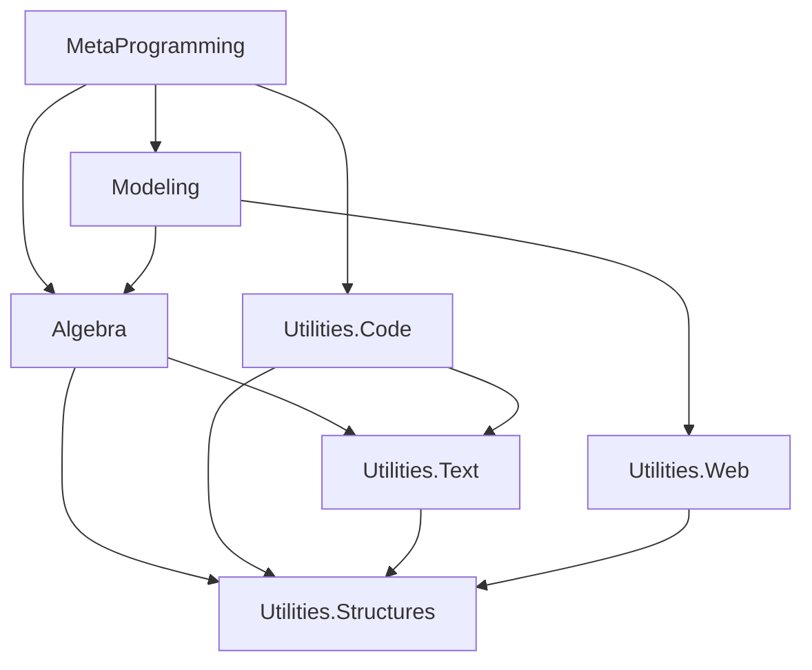

# Architecture Overview

GA-FuL employs a sophisticated four-layer architecture based on Data-Oriented Programming (DOP) principles that promotes modularity, performance, and maintainability.

## Four-Layer Architecture Design

GA-FuL follows a sophisticated four-layer architecture design:

1. **System Utilities Layer** (Foundation)
2. **Algebra Layer** (Core Mathematics)
3. **Modeling Layer** (High-level Abstractions)
4. **Metaprogramming Layer** (Code Generation)

### Data Flow Between Layers
```
Layer 4: MetaProgramming (Code Generation)
    ↓ depends on
Layer 3: Modeling (High-level Abstractions) 
    ↓ depends on      
Layer 2: Algebra (Core Mathematics)
    ↓ depends on      
Layer 1: System Utilities (Foundation)
```

## Layer Responsibilities

### Layer 1: System Utilities (Foundation)
**Purpose**: Provides fundamental data structures and utilities that form the foundation for all higher layers.

**Key Components**:
- **IndexSets**: Optimized basis blade index management with multiple implementations
- **Collections**: Sparse and dense data structures for efficient storage
- **Text Generation**: Code composition and formatting utilities
- **Dependency Management**: Graph-based dependency tracking and analysis

**Design Principles**:
- Zero dependencies on higher layers
- Highly optimized for performance-critical operations
- Generic and reusable across different mathematical contexts

### Layer 2: Algebra (Core Mathematics)
**Purpose**: Implements the core mathematical engine including scalar processors and geometric algebra operations.

**Key Components**:
- **Scalar Processors**: Generic interfaces supporting multiple number systems
- **Geometric Algebra Core**: Complete GA implementation with multivector operations
- **Linear Algebra**: Classical linear algebra structures and operations
- **Symbolic Systems**: Integration with computer algebra systems

**Design Principles**:
- Generic algorithms working across all scalar types
- Immutable data structures with efficient operations
- Sparse storage optimized for high-dimensional spaces

### Layer 3: Modeling (High-level Abstractions)
**Purpose**: Provides high-level geometric modeling abstractions and visualization capabilities.

**Key Components**:
- **Conformal GA**: 5D CGA for 3D geometry operations
- **Parametric Geometry**: Curves, surfaces, and complex shapes
- **Visualization**: Multi-backend rendering and animation systems
- **Application Domains**: Specialized modeling for robotics, graphics, etc.

**Design Principles**:
- Domain-specific abstractions built on solid mathematical foundations
- Multiple visualization backends for different use cases
- Integration with popular graphics and modeling frameworks

### Layer 4: MetaProgramming (Code Generation)
**Purpose**: Enables optimized code generation from GA expressions for multiple target languages.

**Key Components**:
- **Expression Trees**: Symbolic representation of mathematical operations
- **Optimization Engine**: Algebraic simplification and performance optimization
- **Multi-Language Composers**: Code generation for C++, Python, MATLAB, GLSL, etc.
- **Performance Analysis**: Benchmarking and optimization guidance

**Design Principles**:
- Language-agnostic expression representation
- Aggressive optimization for performance-critical applications
- Seamless integration with existing development workflows

## Design Principles (Data-Oriented Programming)

The library is built on Data-Oriented Programming (DOP) principles:

- **DOP-1**: Separation of behavior code from data
- **DOP-2**: Generic data structures (dictionaries, arrays)
- **DOP-3**: Immutable data with composer pattern
- **DOP-4**: Separation of data representation from schema

### Why DOP?
DOP provides several advantages over traditional OOP for GA-FuL:

#### Reduced Complexity
- Avoids deep coupling between data and behavior
- Eliminates complex inheritance hierarchies
- Makes code easier to understand and debug
- Reduces the cognitive load for new developers

#### Better Performance
- More efficient memory usage patterns
- Better cache locality for mathematical operations
- Enables SIMD and GPU optimization opportunities
- Reduces virtual function call overhead

#### Enhanced Maintainability
- Clear separation makes testing and refactoring easier
- Generic algorithms reduce code duplication
- Extension methods provide clean API organization
- Data immutability eliminates many classes of bugs

#### Type Safety
- Generic design provides compile-time type checking
- Prevents many common mathematical operation errors
- Enables better IDE support and IntelliSense
- Facilitates automated testing and verification

## Dependency Management

### Project Dependencies and Layers

#### Dependency Graph


### Dependency Principles
1. **Unidirectional Dependencies**: Higher layers depend on lower layers, never the reverse
2. **Minimal Coupling**: Each layer exposes only necessary abstractions
3. **Interface Segregation**: Multiple small interfaces rather than large monolithic ones
4. **Dependency Injection**: External dependencies are injected rather than hard-coded

## Extension Points

### Scalar Processor Extensions
Add new number systems by implementing `IScalarProcessor<T>`:
- Custom precision arithmetic
- Interval arithmetic
- Fuzzy number systems
- Domain-specific number representations

### Visualization Backend Extensions
Add new rendering systems by implementing visualization interfaces:
- Game engines (Unity, Unreal, Godot)
- Scientific visualization (VTK, ParaView)
- Web technologies (Three.js, WebGPU)
- CAD systems (OpenCASCADE, FreeCAD)

### Code Generation Targets
Extend metaprogramming to new languages:
- Functional languages (Haskell, F#, Clojure)
- Domain-specific languages (SQL, R, Julia)
- Hardware description languages (Verilog, VHDL)
- Assembly optimizations (x86, ARM, RISC-V)

## Performance Considerations

### Memory Management
- **Sparse Storage**: Only non-zero coefficients stored
- **Immutable Data**: Safe sharing without copying
- **Object Pooling**: Reduced garbage collection pressure
- **SIMD Alignment**: Memory layouts optimized for vectorization

### Computational Efficiency
- **Generic Specialization**: JIT optimization for specific scalar types
- **Lookup Tables**: Pre-computed operations for small dimensions
- **Parallel Algorithms**: Multi-threaded operations where beneficial
- **GPU Acceleration**: CUDA and OpenCL support for large-scale computations

---

**[← Previous: Executive Summary](executive-summary.md) | [Next: Project Structure →](project-structure.md)**