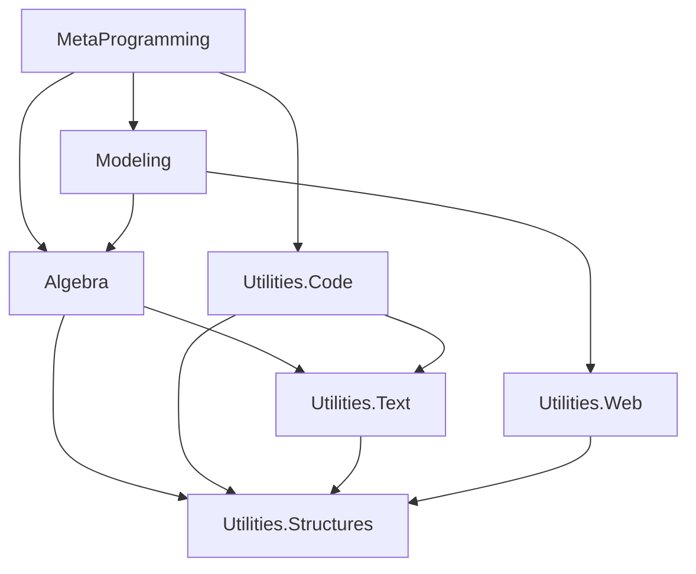

# Project Structure Analysis

This document provides a comprehensive analysis of the GeometricAlgebraFulcrumLib repository structure, including all projects and their interdependencies.

## Solution Organization

The repository contains two main solutions:

- **Main Solution**: `GeometricAlgebraFulcrumLib.sln` (15 projects)
- **Auxiliary Solution**: `GAPoTNumLib.sln` (2 projects)

### Repository Structure
```
GeometricAlgebraFulcrumLib/
├── GeometricAlgebraFulcrumLib/           # Main solution directory
│   ├── GeometricAlgebraFulcrumLib.Utilities.Structures/
│   ├── GeometricAlgebraFulcrumLib.Utilities.Text/
│   ├── GeometricAlgebraFulcrumLib.Utilities.Code/
│   ├── GeometricAlgebraFulcrumLib.Algebra/
│   ├── GeometricAlgebraFulcrumLib.Modeling/
│   ├── GeometricAlgebraFulcrumLib.MetaProgramming/
│   └── ... (other projects)
├── GAPoTNumLib/                          # Auxiliary solution
└── README.adoc                           # Main documentation
```

## Project Dependencies and Layers

### Dependency Graph


## Complete Project Overview

### Foundation Layer (Layer 1)
| Project | Purpose | Dependencies |
|---------|---------|-------------|
| **Utilities.Structures** | Core data structures and algorithms | External packages only |
| **Utilities.Text** | Text generation and formatting | Utilities.Structures |
| **Utilities.Code** | Code generation infrastructure | Utilities.Structures, Utilities.Text |
| **Utilities.Web** | Web graphics and visualization | Utilities.Structures |

### Mathematics Layer (Layer 2)
| Project | Purpose | Dependencies |
|---------|---------|-------------|
| **Algebra** | Core mathematical engine and GA implementation | Utilities.Structures, Utilities.Text |

### Application Layer (Layer 3)
| Project | Purpose | Dependencies |
|---------|---------|-------------|
| **Modeling** | High-level geometric modeling | Algebra, Utilities.Web |

### Generation Layer (Layer 4)
| Project | Purpose | Dependencies |
|---------|---------|-------------|
| **MetaProgramming** | Expression trees and code generation | Algebra, Modeling, All Utilities |

### Supporting Projects
| Project | Purpose | Dependencies |
|---------|---------|-------------|
| **Applications** | Real-world application examples | Algebra, Modeling |
| **Applications.Symbolic** | Symbolic computation applications | Applications |
| **Mathematica** | Wolfram Mathematica integration | Algebra |
| **Optimization** | Optimization algorithms | Algebra |
| **UnitTests** | Comprehensive test suite | All projects |
| **Benchmarks** | Performance benchmarking | All projects |
| **Samples.Generations** | Generated code examples | MetaProgramming |

### Platform Integration Projects
| Project | Purpose | Target Platform |
|---------|---------|-----------------|
| **Stride** | Stride 3D engine integration | Stride Game Engine |
| **MonoGame** | MonoGame framework integration | MonoGame/XNA |
| **Matlab** | MATLAB integration and code generation | MATLAB/Octave |

### Auxiliary Projects (GAPoTNumLib)
| Project | Purpose | Specialization |
|---------|---------|----------------|
| **GAPoTNumLib** | Core numerical GA implementation | Power-of-2 dimensions |
| **GAPoTNumLib.Framework** | Framework and samples | High-performance numerical GA |

## Key External Dependencies

### Mathematical and Numerical Computing
- **AngouriMath**: Pure C# symbolic mathematics
- **MathNet.Numerics**: Numerical linear algebra
- **PeterO.Numbers**: Arbitrary precision arithmetic
- **Wolfram Mathematica**: External symbolic computation engine

### Graphics and Visualization
- **SixLabors.ImageSharp**: Image processing and manipulation
- **SkiaSharp**: 2D graphics and rendering
- **OxyPlot**: Data visualization and plotting
- **Magick.NET**: Advanced image processing

### Code Generation and Parsing
- **Irony**: Language parsing framework
- **CS-Script**: Dynamic C# compilation
- **EPPlus**: Excel file generation

### High-Performance Computing
- **ILGPU**: GPU computing framework
- **HonkPerf.NET**: Performance monitoring
- **NumpyDotNet**: NumPy-like operations for .NET

### Development and Testing
- **Selenium WebDriver**: Browser automation for testing
- **GeneticSharp**: Genetic algorithm optimization
- **CSharpMath**: Mathematical expression rendering

## Project Interaction Patterns

### Data Flow Patterns

1. **Foundation → Mathematics**: Utilities provide the foundational data structures used by algebraic operations
2. **Mathematics → Modeling**: Algebraic operations are wrapped in high-level geometric abstractions
3. **Modeling → Applications**: Geometric abstractions are applied to real-world problem domains
4. **All Layers → MetaProgramming**: Expression trees capture operations from all layers for code generation

### Extension Patterns

1. **Scalar Extension**: New scalar types added at the Algebra layer automatically propagate to all higher layers
2. **Visualization Extension**: New rendering backends added at the Modeling layer integrate with existing geometric abstractions
3. **Language Extension**: New target languages added at the MetaProgramming layer can generate code for any GA operation
4. **Application Extension**: New application domains added as separate projects build on existing layers

### Testing Patterns

1. **Unit Testing**: Each layer has comprehensive unit tests verifying core functionality
2. **Integration Testing**: Cross-layer tests verify proper interaction between components
3. **Performance Testing**: Benchmarks measure performance across different use cases and scalar types
4. **Example Testing**: All documentation examples are tested for correctness and maintained

## Development Guidelines

### Adding New Projects

1. **Determine Layer**: Identify which architectural layer the new project belongs to
2. **Define Dependencies**: Establish minimal necessary dependencies on lower layers
3. **Follow Patterns**: Use established patterns for similar functionality
4. **Add Tests**: Include comprehensive testing following existing patterns
5. **Update Documentation**: Add project to this overview and relevant layer documentation

### Modifying Existing Projects

1. **Understand Dependencies**: Know what projects depend on the one being modified
2. **Maintain Interfaces**: Preserve public interfaces to avoid breaking downstream projects
3. **Update Tests**: Ensure all tests continue to pass
4. **Consider Performance**: Evaluate impact on performance-critical paths
5. **Document Changes**: Update relevant documentation and examples

---

**[← Previous: Architecture Overview](architecture.md) | [Next: Layer 1 - System Utilities →](layer1-utilities.md)**